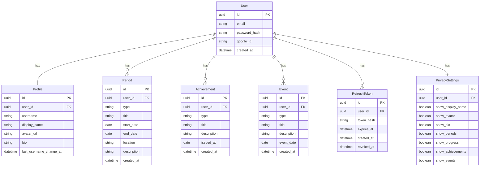

```mermaid
erDiagram
    User ||--|| Profile : has
    User ||--o{ Period : has
    User ||--o{ Achievement : has
    User ||--o{ Event : has
    User ||--o{ RefreshToken : has
    User ||--|| PrivacySettings : has

    User {
        uuid id PK
        string email
        string password_hash
        string google_id
        datetime created_at
    }

    Profile {
        uuid id PK
        uuid user_id FK
        string username
        string display_name
        string avatar_url
        string bio
        datetime last_username_change_at
    }

    Period {
        uuid id PK
        uuid user_id FK
        string type
        string title
        date start_date
        date end_date
        string location
        string description
        datetime created_at
    }

    Achievement {
        uuid id PK
        uuid user_id FK
        string type
        string title
        string description
        date issued_at
        datetime created_at
    }

    Event {
        uuid id PK
        uuid user_id FK
        string type
        string title
        string description
        date event_date
        datetime created_at
    }

    RefreshToken {
        uuid id PK
        uuid user_id FK
        string token_hash
        datetime expires_at
        datetime created_at
        datetime revoked_at
    }

    PrivacySettings {
        uuid id PK
        uuid user_id FK
        boolean show_display_name
        boolean show_avatar
        boolean show_bio
        boolean show_periods
        boolean show_progress
        boolean show_achievements
        boolean show_events
    }
```